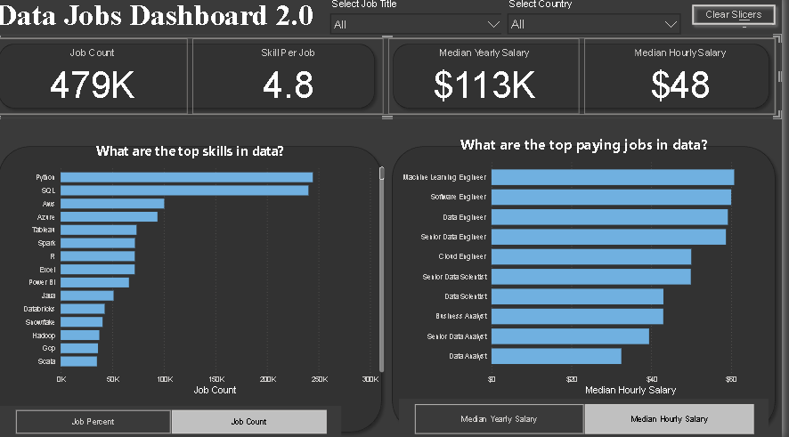

# Data Job Market Dashboard
## 📊 Preview of the Dashboard

*(The above screenshot represents an interactive Power BI dashboard built during the project.)*

## 📌 Project Introduction
This project was created for **Job Seekers, Job Transitioners, and, Job Swappers** to solve a common problem; information about the data job market is scattered and hard to grasp. Using a *real-world dataset of 2024 data science job postings* (including titles, salaries, and locations), this project provides a single, easy-to-use interface to explore market trends and compensation.

## 🛠 Tools & Technologies Used
- **Power BI Desktop** for visualization.
- **Excel / CSV datasets** for data cleaning and preparation.
- **Data Cleaning & Transformation**
- **DAX (Data Analysis Expressions)**  for advanced calculations.

## 🔍 Key Features
✔ **Data Cleaning & Modeling:** Applied Power Query to clean, transform, and structure raw data.  
✔ **Interactive Dashboards:** Created dynamic dashboards with slicers, filters, and drill-through features.  
✔ **KPIs & Metrics:** Displayed key business indicators for better decision-making.  
✔ **Data Insights:** Highlighted trends, patterns, and anomalies in the dataset.  
- Highest demand for **Data Analysts** in major tech hubs
- Average salaries vary significantly by region
- Remote job opportunities are steadily increasing

## ✅ Objectives
- Improve **data-driven decision making**.
- Build **professional, visually appealing dashboards**.
- Showcase **business intelligence skills** in real-world scenarios.

  ## 📊 Dashboard Overview

### Page 1: High-Level Market View

This is your mission control for the data job market. It showcases key KPIs like total job count, median salaries and top job titles to give you a quick understanding of what's happening in the job market at a glance.

### Page 2: Job Title Drill Through

This is a deep-dive page. From the main dashboard, you can drill through to this view to get specific details for a single job title, including salary ranges, work-from home stats, top hiring platforms and a global map of job locations.

# 📊 Data Jobs Dashboard Project (Power BI)

## 📌 Project Overview
This project focuses on analyzing the **data job market** using **Power BI**. The dashboard provides key insights into:
- **Job counts** and trends
- **Salary analysis** (hourly & yearly)
- **Top skills required**
- **Top-paying job roles**

The purpose of this project is to **visualize the state of data-related jobs** and help job seekers, recruiters, and analysts make informed decisions.

---

## 🖼 Project 2

## Introduction

Navigating the data job market can feel like a maze with information scattered everywhere. This dashboard (v2.0) is designed specifically for **Job Seekers, Job Transitioners, and Job Swappers** to cut through the clutter! Using a real-world dataset of 2024 Data science job postings-rich with details on titles, salaries, and locations-this project offers a streamlined, single-page interface to quickly explore crucial market trends and compensation insights.

---

## 🛠 Skills Showcased
- **Dashboard Design**: Crafting an intuitive and visually appealing report layout.
- **Power Query ETL**: Performing data cleaning, shaping, and transformation. 
- **DAX (Data Analysis Expressions)** – For advanced calculations and aggregations to derive key insights.  

---

## 🔍 Key Features
✔ **Dynamic Filters** for Job Titles & Countries  
✔ **Salary Comparisons** (Hourly vs Yearly)  
✔ **Top Skills in Data Jobs**  
✔ **Top Paying Roles in Data Industry**  
✔ **Interactive Visualizations** for better decision-making  

---

## ✅ Objectives
- Analyze job trends in the **data industry**
- Compare **salary variations across roles**
- Identify **top technical skills** employers demand

---
## ▶ How to Use
1. Download the `.pbix` file from this repository.
2. Open it using **Power BI Desktop**.
3. Explore the dashboards, filters, and visuals.
4. Connect with your own dataset if you want to replicate the project.

## 🚀 Why This Project Matters
In today’s competitive market, understanding **job demand and skills** is essential. This dashboard provides **data-driven insights** to help job seekers and businesses make **better decisions**.

---

## 🙌 Final Thoughts
This project is not just about creating visuals; it’s about **telling the story behind the data**. It showcases problem-solving skills, attention to detail, and a passion for **business intelligence**.

**If you find this helpful, feel free to ⭐ this repository and connect with me on [LinkedIn](https://www.linkedin.com/in/chukwuma-duru-2896ab333?utm_source=share&utm_campaign=share_via&utm_content=profile&utm_medium=android_app).**
**Email:** chukwuduru588@gmail.com  

---

